# Coder Academy MERN App (Part A) - Naruto Run

## by Ryan Challen, Adam Hyde & David Johnson (Team RAD)

Client Deployed at: https://naruto-run.netlify.app/

Server Deployed at: HEROKU URL TBC

#### GitHub Repositories:

Client: https://github.com/Team-RAD/Naruto_Run_Client

Server: https://github.com/Team-RAD/Naruto_Run_Server

### R1 - Description of website

#### Purpose

_Problem:_ Technology is a massive industry with many pathways of entry and career directions to take. It’s often very daunting for new tech hopefuls to get started on their journey and this can be made harder by uncertainty with how best to proceed due to seemingly limitless opinions online.

Consider Jane: She is a career changer who is moving from retail to technology… but she has a great deal of “options paralysis” due to the sheer amount of information online about how she should make this happen. Any Google search yields thousands of opinions and resources and this can make even the most determined person confused and even discouraged.

_Solution:_ Naruto Run helps to speed up the process of identifying which area of the tech world people want to work in and the best road to run down to get there. It does this by providing a hub for the posting of tech career journeys by users already in the industry (contributors) for the reference of other users (seekers) wanting to make the move into tech. It allows contributors to outline their path into a tech career in a condensed, efficient form, so that seekers can quickly distill this information and that of other NR posts into a clearer picture of where they should focus their efforts.

#### Features

- Nav Bar (Links: Home, About, Posts, Login/Sign Up (or Logout if already logged in))
- About Page
- Login Page with Form
- Register Page with Form
- View all posts page
- View individual post page
- Create Post Page with Form
- Edit Post Page with Form
- Edit and Delete Post Buttons
- Profile page to display user posts/saved posts
- Search posts by keyword (SPRINKLE)
- Comment and ask questions on posts (SPRINKLE)
- Rate a post (SPRINKLE)
- User profile image upload (SPRINKLE)

#### Target Audience:

Naruto Run's target audience has two demographics:

- People who have achieved a career in tech and want to pay their experience forward to people looking to do the same.

- People who are seeking the optimal path to a career in tech without the "options paralysis" experience of having to scour the internet for answers.

#### Tech Stack:

- MongoDB for data storage
- ExpressJS for web server
- ReactJS for client UI
- NodeJS for server runtime
- Bootstrap4 for UI styling
- Mongoose for server middleware
- Netlify for front-end hosting
- Heroku for back-end hosting

### R2 - Data Flow Diagram

### R3 - Application Architecture Diagram

### R4 - User Stories

### R5 - Wireframes

#### Initial Concept

All Posts/Landing Page

Detailed Post View

About Page

Create/Edit Post Page

Saved Posts/My Posts Page

#### Planning Concept & Desktop Final

All Posts/Landing Page

Detailed Post View

About Page

Create/Edit Post Page

Saved Posts/My Posts Page

#### Refined Concept & Mobile/Tablet View

##### Mobile

All Posts/Landing Page
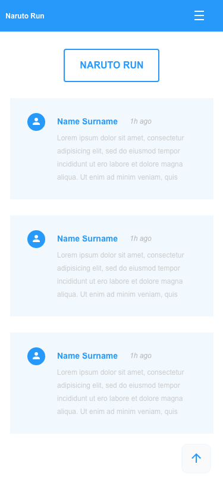
Detailed Post View
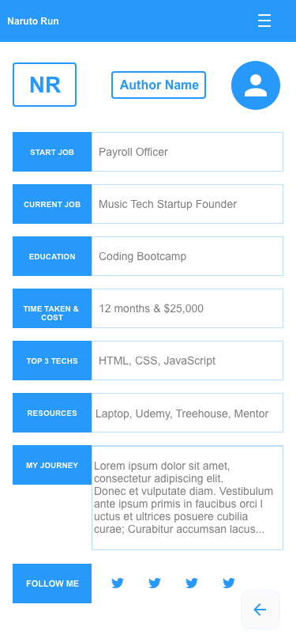
About Page
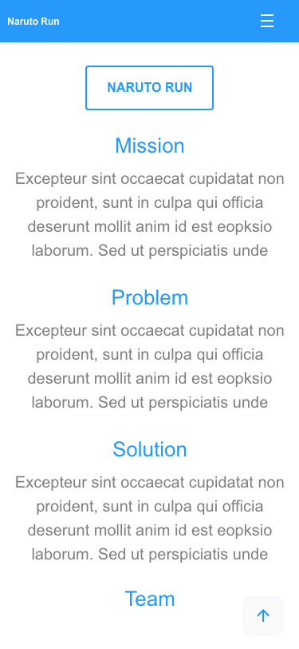
Create/Edit Post Page
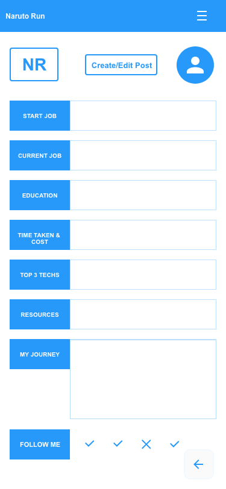
Saved Posts/My Posts Page
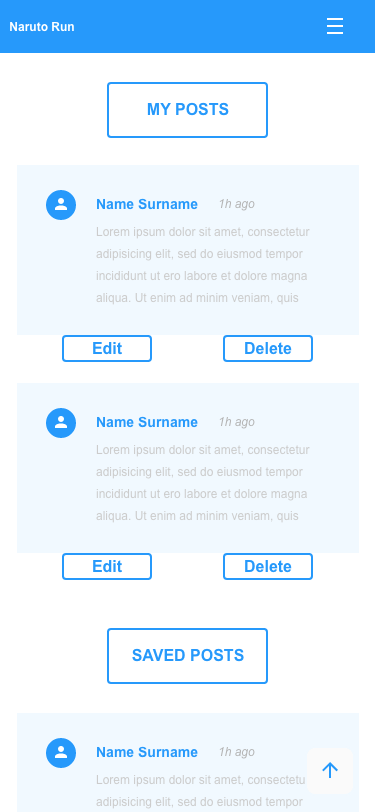

##### Tablet

All Posts/Landing Page
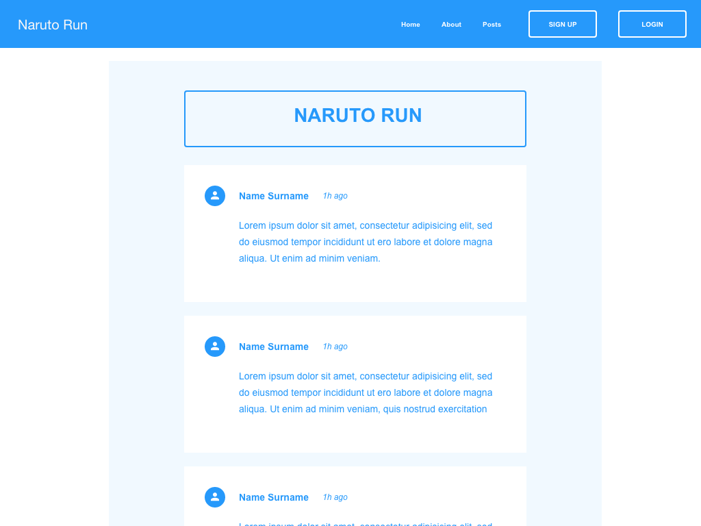
Detailed Post View
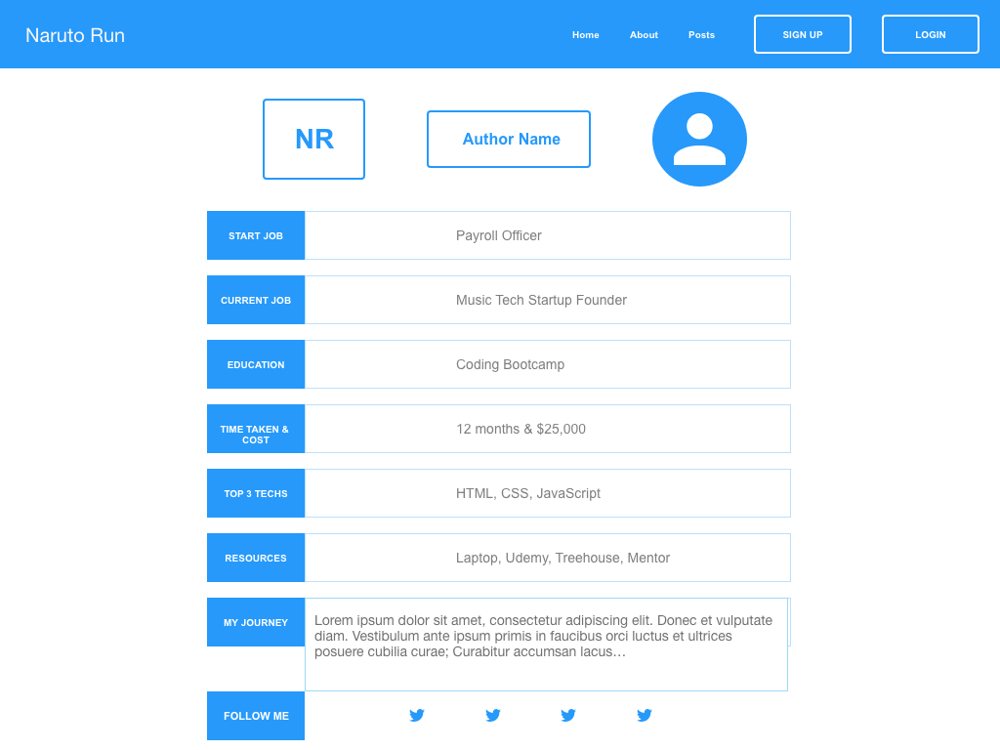
About Page
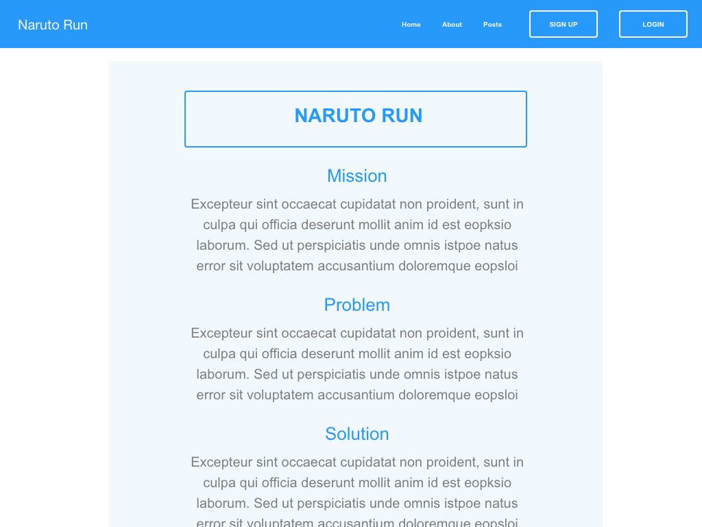
Create/Edit Post Page
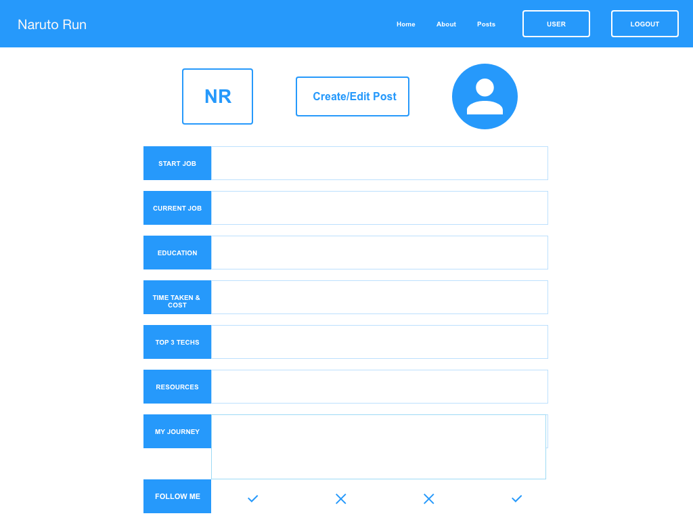
Saved Posts/My Posts Page
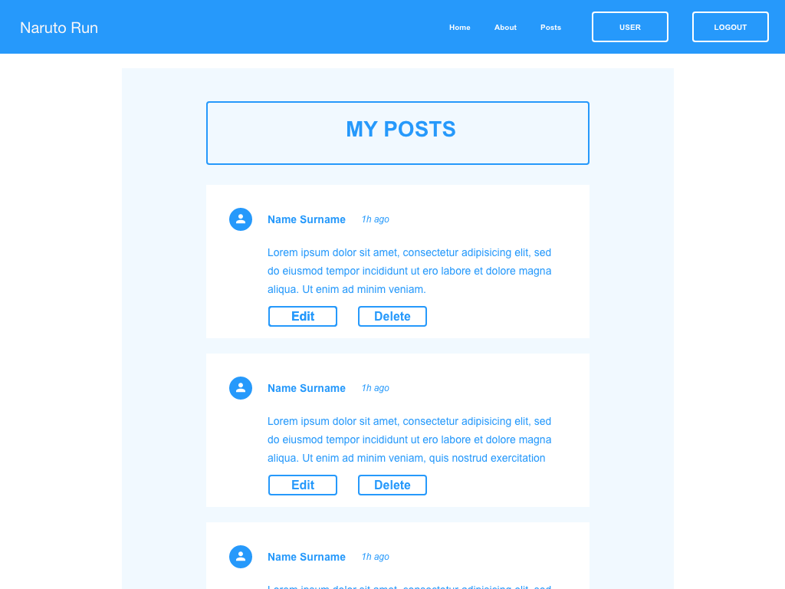

### R6 - Trello Task Management

Initial

Stage 1

Stage 2

Stage 3
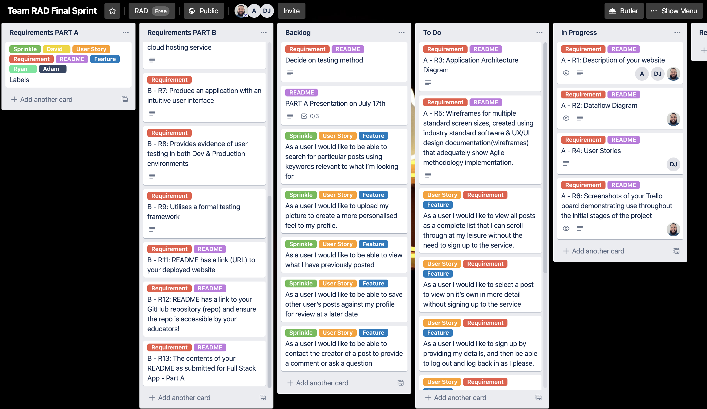

Stage 4
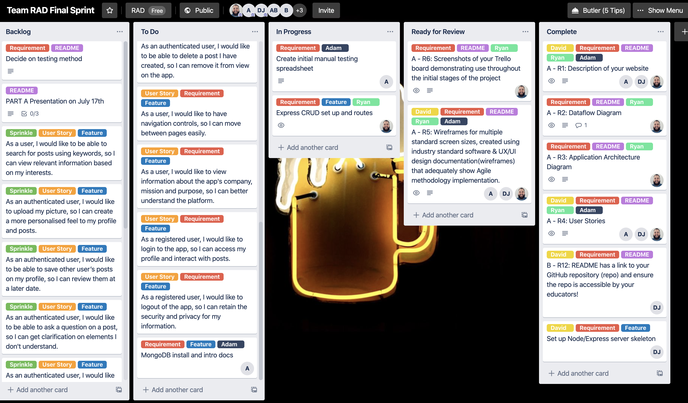

Stage 5

Stage 6
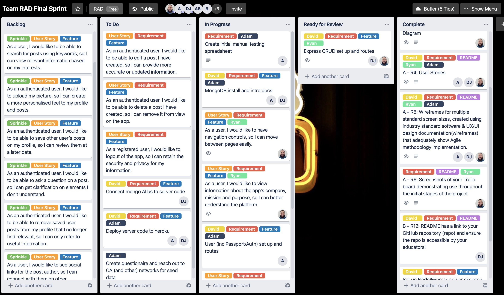
